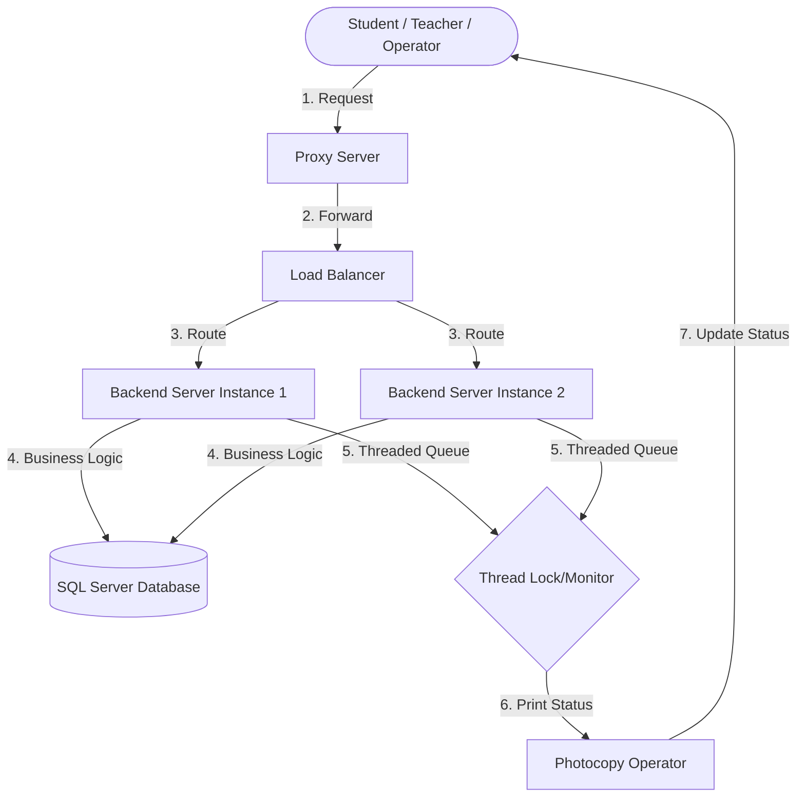

# Project Implementation Plan: Stationary & Photocopies System

## 1. Project Overview
A multi-user system for managing printing requests and stationery sales. The project focuses on Parallel and Distributed Computing (PDC) by handling many student requests at the same time using C# threading and synchronization.

---

## 2. System Flow Graph (Distributed Architecture)
This diagram shows how a request travels from a Student/Teacher to the Database and Print Engine.



---

## 3. Team Roles & Assignments (9 Members)
Lead: Muhammad Mujtaba (Responsible for Integration & GitHub Management).

| Name | Student ID | Task Role | Responsibilities |
| :--- | :--- | :--- | :--- |
| Muhammad Mujtaba | 23-3738 | Lead Architect | Set up MVC, merge code, and handle GitHub. |
| Malaika Qamar | 23-3720 | DB Specialist | SQL Server setup and C# Database connection logic. |
| Maryam Munir | 23-3725 | PDC Specialist | Threading Logic: Print queue using locks or monitors. |
| Noor-ul-huda | 23-3872 | PDC Specialist | Concurrency: Handling multiple requests & Cancellation logic. |
| Muskan | 23-3860 | UI Designer | Student Dashboard (Note selection & Payment view). |
| Muhammad Fazil | 23-3773 | UI Designer | Teacher Dashboard (Upload notes) & Operator view. |
| Misbah Naseer | 23-3732 | Inventory Logic | Stationery sales system and Fine calculation logic. |
| Hadain Arshad | 23-3659 | Load Balancing | Implement Round-Robin logic for traffic distribution. |
| Sheikh Muhammad Awais | 23-3912 | Proxy/Networking | Implement the Proxy Server for request forwarding. |

---

## 4. The GitHub Beginner to Pro Setup
Muhammad Mujtaba will create the repository. Everyone else will follow these steps:

### Step A: For Mujtaba (Owner)
1. Create a Repo on GitHub named PhotocopySystem.
2. In your local project folder, run:
    ```powershell
    git init
    dotnet new mvc -n PhotocopySystem
    git add .
    git commit -m "Initial Setup"
    git remote add origin https://github.com/LtNITESNAKE/Stationary-Photocopies-System.git
    git push -u origin main
    ```
3. Add all 8 teammates as Collaborators on GitHub.

### Step B: For the Team (Contributors)
1. Clone: git clone https://github.com/LtNITESNAKE/Stationary-Photocopies-System.git
2. Branch: git checkout -b task-name (Always work on a branch!).
3. Work: Write your code and save.
4. Push: git add . -> git commit -m "Done" -> git push origin task-name.
5. Merge: Create a Pull Request on GitHub for Mujtaba to review.

