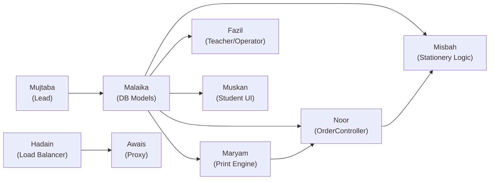

# 🚀 Team Meeting Briefing — Stationary & Photocopies System

## Project Status: 🟡 Skeleton Ready — Members Need to Start Coding

The MVC project is initialized with a default `HomeController`, default views, and a separate `PhotocopyProxy` console app. **No member has written any code yet.** All role docs and the folder guide are ready.

---

## Architecture at a Glance

```
Student/Teacher (Browser)
       │
       ▼
  [Proxy Server]  ← Awais (Port 8080)
       │
       ▼
  [Load Balancer]  ← Hadain (Round-Robin)
      / \
     ▼   ▼
 [Server 1]  [Server 2]   ← Both run the same MVC app (5001 / 5002)
     │         │
     ▼         ▼
 [Controllers]  ← Noor (OrderController), Misbah (StationeryController), Fazil (Teacher/Operator Controllers)
     │
     ▼
 [Services/PrintJobManager]  ← Maryam (Threading & Locks)
     │
     ▼
 [Database via EF Core]  ← Malaika (Models, DbContext, Migrations)
     │
     ▼
 [Views / UI]  ← Muskan (Student pages), Fazil (Teacher/Operator pages), Misbah (Stationery pages)
```

---

## 👤 Per-Member Task Summary

### 1. Muhammad Mujtaba — Lead Architect & Integration
| What | Details |
|---|---|
| **Branch** | `main` (direct push as owner) |
| **Files** | `Views/Shared/_Layout.cshtml`, `appsettings.json`, `Program.cs` |
| **Day 1** | Update `_Layout.cshtml` navbar: add links for Student, Teacher, Operator, Stationery portals. Update footer with 9 member names |
| **Day 2** | Add the DB connection string in `appsettings.json` pointing to `MUJTABA\SQLEXPRESS`, database `PhotocopyDB` |
| **Day 3–5** | Review & merge Pull Requests from all 8 members. Help Awais/Hadain test the Proxy + Load Balancer integration |
| **Deliverable** | Working navbar, connection string configured, all PRs merged cleanly |

### 2. Malaika Qamar — Database Specialist
| What | Details |
|---|---|
| **Branch** | `dev-malaika-database` |
| **Files** | `Models/Order.cs`, `Models/User.cs`, `Models/Note.cs`, `Models/StationeryItem.cs`, `Data/ApplicationDbContext.cs` |
| **Day 1–2** | Create all 4 Model classes (Order, User, Note, StationeryItem) |
| **Day 2–3** | Create `Data/` folder, write `ApplicationDbContext.cs` with `DbSet<>` for each model. Register it in `Program.cs` |
| **Day 4–5** | Run `Add-Migration InitialCreate` then `Update-Database`. Verify tables in SSMS |
| **Deliverable** | All tables created in SQL Server, code pushed & PR submitted |

> [!IMPORTANT]
> **Malaika is on the critical path.** Nobody can do real DB work until her Models + DbContext are merged. She should finish and push by **Day 2** at the latest.

### 3. Maryam Munir — PDC Specialist (Print Engine)
| What | Details |
|---|---|
| **Branch** | `dev-maryam-pdc-engine` |
| **Files** | `Services/PrintJobManager.cs` |
| **Day 1–2** | Create `Services/` folder. Build `PrintJobManager` with `lock` mechanism and `Queue<int>` for order IDs |
| **Day 3–4** | Add status tracking: update order status to "Printing" → "Completed" in DB (needs Malaika's models) |
| **Day 5** | Stress test: trigger 10 print jobs in a loop, verify sequential execution in console |
| **Deliverable** | Thread-safe print queue that processes one job at a time |

### 4. Noor-ul-huda — PDC Specialist (Concurrency)
| What | Details |
|---|---|
| **Branch** | `dev-noor-concurrency` |
| **Files** | `Controllers/OrderController.cs` |
| **Day 1–2** | Create `OrderController` with async `Create` action (saves order to DB with status "Queued") |
| **Day 3–4** | Add `Cancel` action: if status is "Queued" → delete; if "Printing"/"Completed" → calculate fine (coordinate with Misbah) |
| **Day 5** | Add estimated pickup time calculation (count orders ahead × 5 seconds) |
| **Deliverable** | Async order creation, cancellation with fine logic, pickup time estimate |

### 5. Muskan — UI Designer (Student Portal)
| What | Details |
|---|---|
| **Branch** | `dev-muskan-student-ui` |
| **Files** | `Views/Student/Index.cshtml`, `Views/Student/Order.cshtml`, `Views/Student/MyOrders.cshtml` |
| **Day 1–2** | Create `Views/Student/` folder. Build `Index.cshtml` — table of available notes with search bar |
| **Day 3–4** | Build `Order.cshtml` — order form with copies input, version dropdown, live price calculation |
| **Day 5** | Build `MyOrders.cshtml` — order tracking table with colored Bootstrap badges (Queued/Printing/Ready) |
| **Deliverable** | 3 fully styled student-facing pages |

### 6. Muhammad Fazil — UI Designer (Teacher + Operator)
| What | Details |
|---|---|
| **Branch** | `dev-fazil-admin-ui` |
| **Files** | `Views/Teacher/Index.cshtml`, `Views/Operator/Dashboard.cshtml`, `Controllers/TeacherController.cs`, `Controllers/OperatorController.cs` |
| **Day 1–2** | Create `Views/Teacher/` folder. Build teacher upload form (`enctype="multipart/form-data"`) |
| **Day 3–4** | Create `Views/Operator/` folder. Build operator dashboard with order table, Start/Complete buttons, search bar |
| **Day 5** | Add auto-refresh (10-second `setTimeout`) to the Operator dashboard |
| **Deliverable** | Teacher upload page + Operator command center with auto-refresh |

### 7. Misbah Naseer — Inventory & Business Logic
| What | Details |
|---|---|
| **Branch** | `dev-misbah-inventory` |
| **Files** | `Controllers/StationeryController.cs`, `Views/Stationery/Index.cshtml` |
| **Day 1–2** | Create `Views/Stationery/` folder. Build shop page with Bootstrap cards (name, price, stock, Buy button) |
| **Day 3–4** | Create `StationeryController` with `Buy` action — check stock > 0, decrement, save. Show out-of-stock / low-stock warnings |
| **Day 5** | Write fine calculation logic: `Fine = Copies × PricePerPage`. Coordinate with Noor for late cancellation flow |
| **Deliverable** | Working stationery shop page + buy logic + fine calculator |

### 8. Hadain Arshad — Load Balancer
| What | Details |
|---|---|
| **Branch** | `dev-hadain-load-balancer` |
| **Files** | `PhotocopyProxy/LoadBalancer.cs` (new class inside the Proxy project) |
| **Day 1–2** | Create `LoadBalancer` class with `GetNextServer()` using modulo round-robin between ports 5001 & 5002 |
| **Day 3–4** | Integrate with Awais's Proxy — every incoming request calls `GetNextServer()` |
| **Day 5** | Run 2 server instances + proxy, verify alternating traffic in console logs |
| **Deliverable** | Working round-robin function integrated into the Proxy |

### 9. Sheikh Muhammad Awais — Proxy & Networking
| What | Details |
|---|---|
| **Branch** | `dev-awais-proxy` |
| **Files** | `PhotocopyProxy/Program.cs` |
| **Day 1–2** | Build TCP Listener on port 8080 — accept connections, read request bytes, log to console |
| **Day 3–4** | Forward traffic: use Hadain's `GetNextServer()`, create `TcpClient` to backend, relay response back |
| **Day 5** | Full integration test: Proxy → Load Balancer → 2 MVC instances. Verify in browser at `http://localhost:8080` |
| **Deliverable** | Working proxy that forwards HTTP traffic and logs everything |

---

## 🔗 Dependency Map — Who Needs Whom



**Key takeaways:**
- **Malaika** must finish Models first — everyone depends on her DB schema
- **Hadain** must finish `LoadBalancer` before **Awais** can forward traffic
- **Noor** and **Misbah** must coordinate on the fine/cancellation logic
- **Maryam** needs Malaika's DB to update order statuses
- **Muskan** and **Fazil** can start building static HTML immediately (hardcode sample data), then hook up to real data after Malaika's PR is merged
- **Mujtaba** sets up connection string early so Malaika can run migrations

---

## 📅 Suggested 5-Day Sprint Timeline

| Day | Milestone | Who's Active |
|---|---|---|
| **Day 1** | Mujtaba: navbar + connection string. Malaika: all Models done. UI team: start static pages. Awais: TCP listener skeleton | ALL |
| **Day 2** | Malaika: DbContext + push PR. Maryam: PrintJobManager with lock. Hadain: LoadBalancer class done | Malaika (critical), Maryam, Hadain |
| **Day 3** | Mujtaba merges Malaika's PR → everyone `git pull`. Noor: OrderController. Misbah: Buy logic. Awais: forwarding | Noor, Misbah, Awais |
| **Day 4** | Maryam: status tracking via DB. Fazil: Operator dashboard. Muskan: Order form. Hadain+Awais: integrate | Maryam, Fazil, Muskan, Hadain, Awais |
| **Day 5** | Full integration test. Stress test (Maryam). Fine logic (Noor+Misbah). Auto-refresh (Fazil). Final PR merge | ALL |

---

## ❓ Anticipated FAQ — Ready Answers for the Meeting

### Q1: "I don't have SQL Server on my laptop. What do I do?"
> Install **SQL Server Express** (free) + **SSMS**. Or use **LocalDB** which comes with Visual Studio. After Malaika pushes her code, run `Update-Database` in Package Manager Console to create tables on YOUR local machine.

### Q2: "How do I get Malaika's database code on my branch?"
> Run `git pull origin main` after Mujtaba merges her PR. Then continue working on your own branch.

### Q3: "Can I start coding if Malaika hasn't finished the Models yet?"
> **Yes.** UI members (Muskan, Fazil, Misbah) should hardcode sample data in their HTML views first. When the DB is ready, replace hardcoded data with `@Model` bindings. Awais and Hadain don't need the DB at all — they work in the Proxy project.

### Q4: "How do Awais and Hadain work together? They're both in PhotocopyProxy."
> Hadain creates a **separate class file** `LoadBalancer.cs` inside the PhotocopyProxy project. Awais writes in `Program.cs`. Awais calls `LoadBalancer.GetNextServer()` — no file conflicts.

### Q5: "What is the fine formula?"
> `Fine = Number of Copies × Price Per Page (2.5 PKR)`. Misbah writes the formula, Noor calls it when a late cancellation happens.

### Q6: "How does the Proxy actually connect to the MVC website?"
> The MVC website runs on `localhost:5001` and `localhost:5002`. The Proxy listens on `localhost:8080`. When a browser hits 8080, the Proxy reads the HTTP request, asks the LoadBalancer which port to use, then creates a new TCP connection to that port and relays the response back.

### Q7: "What branch should I work on?"
> Everyone has a dedicated branch name in their role doc. **Never push to `main` directly** (except Mujtaba). Always create a Pull Request.

### Q8: "What do I do when I'm done?"
> Push your branch → create a Pull Request on GitHub → message Mujtaba to review → after merge, help test other members' features.

### Q9: "How do we show this is a PDC project?"
> Three key PDC components: **(1)** Maryam's `lock` mechanism (thread synchronization), **(2)** Noor's `async/await` (concurrency), **(3)** Awais's Proxy + Hadain's Load Balancer (distributed computing with multiple server instances).

### Q10: "What if two students buy the last item at the same time?"
> Misbah must use an **atomic update** — check stock inside a `lock` or use EF Core's concurrency tokens. This prevents overselling. This is also a PDC concept to demonstrate.

---

## 🎯 Critical Reminders to Announce in the Meeting

1. **Clone the repo TODAY**: `git clone https://github.com/LtNITESNAKE/Stationary-Photocopies-System.git`
2. **Create your branch IMMEDIATELY** using the exact name from your role doc
3. **Malaika is Priority #1** — she blocks everyone. Help her if she's stuck
4. **UI team can start NOW** with hardcoded HTML — don't wait for the database
5. **Awais & Hadain work in the `PhotocopyProxy` project** — separate from the main MVC project
6. **Push code daily** — even if incomplete. Mujtaba needs to see progress
7. **Read your role doc completely** — it has vocabulary, example code, and exact file paths
